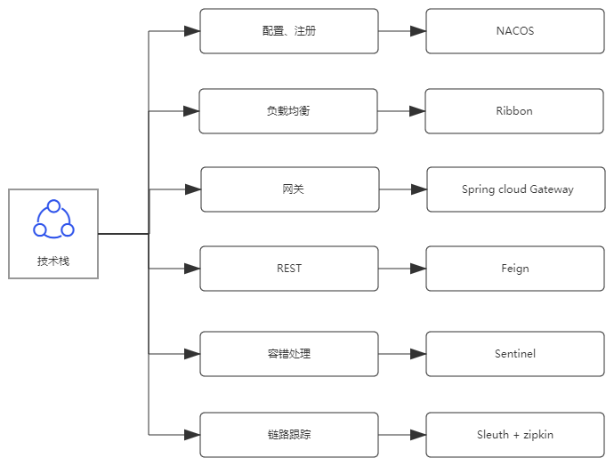

#  工程猫产品研发现阶段技术问题现状分析

> ​        本文档仅针对当前工程猫现阶段技术研发中比较突出的问题展开,未涉及测试、交付、部署等产品研发流程问题。

##  1、现状介绍

目前系统存在如下问题：

- 性能问题：代码不具有维护性和可读性，重复性代码充斥在代码中,
- 耦合问题：当前业务功能模块耦合度高，服务未模块化，服务间的调用不利于产品研发的迭代。没有按照组件以服务的形式提供，围绕业务功能进行组织。
- 效率问题：每模块的新功能或需求都要重新设计接口和联调接口，开发团队和测试团队都花费了很多重复工作量。

## 2、实现目标

+ 更加彻底的组件化，系统内部各个组件之间的解耦
+ 每个服务独立部署，只要服务间的接口稳定，各个系统可以相互之间互不干扰的独立功能开发迭代

##  3、实现方案

### 3.1、服务拆分

+ 按业务功能原则，进行服务拆分，以目前的业务能力范围可拆分为：
  + 客户服务
  + 项目服务
  + 合同服务
  + 财务服务
  + 资源服务
  + 供应链服务
  + 用户服务
  + 系统服务
  + 流程服务
+ 提供服务的接口定义(API)
  + 明确界定服务的能力及边界
  + 明确服务对外暴露的业务协议
+ 服务提供单元测试，便于后期自动化测试，节省测试、交付时间

### 3.2、数据存储

+ 可采取采用SQL + NOSQL 结合的方式存储数据，最大程度利用关系型数据库和非关系型数据库各自的特征。
  + 业务逻辑较强的数据存储在关系型数据库中
  + 涉及内容、页面、日志等功能存储在MongoDB

## 4、方案评估

### 4.1、数据存储比较


+ MongoDB

  + 优点

    ``` 
    1. 数据读取速度快，适合海量的数据，并且数据的增长速度是难以预测的场景
    2. 数据模式自由，无结构限制
    3. 面向文档的存储方式：数据被以JSON风格文档形式存放
    ```

  + 缺点

    ``` 
    1. 运维不方便
    2. 不适用于业务逻辑强关系的数据
    3. 模式自由，自由灵活的文件存储格式带来的数据错误问题，对约束复杂业务场景支持较差。不适合存储业务关系较强的数据。
    ```

  + 使用场景

    ``` 
    1.分析和日志
    2.缓存
    3.内容管理
    4.数据平台
    ```

+ Mysql

  + 优点

    ```undefined
    1. 保持数据的一致性（事务处理）
    2. 由于以数据标准化为前提，数据更新的开销很小（相同的字段基本上都只有一处）
    3. 适合存储复杂的逻辑关系数据
    ```

  + 缺点

    ```undefined
    1. 大量数据的写入处理
    2. 为有数据更新的表做索引或表结构（schema）变更
    3. 字段不固定时，表结构更改困难
    4. 对简单查询需要快速返回结果的处理
    ```

  + 使用场景

    ``` 
    1、适合数据关系复杂的业务系统数据存储
    2、事务性高度要求的系统 
    ```


###  4.2、应用架构图


 ### 4.3、技术用语

 

### 4.4、示例工程结构

```java
engine-cat
        ├── cat-auth 			-- 统一授权服务
        ├── cat-common 			-- 常用工具封装
        ├── cat-gateway 		-- 网关
        ├── cat-ops 			-- 运维中心
        ├    ├── cat-admin 		-- 后台管理
        ├    ├── cat-develop	-- 代码生成
        ├── cat-services 		-- 业务模块
        ├    ├── cat-desk		-- 工作台服务模块 
        ├    ├── cat-log 		-- 日志服务模块 
        ├    ├── cat-system 	-- 系统服务模块 
        ├    └── cat-user 		-- 用户服务模块 
        ├    └── cat-finance 	-- 财务服务模块 
        ├    └── cat-contract 	-- 合同服务模块 
        ├    └── cat-customer 	-- 客户服务模块
   		├    └── cat-project  	-- 项目服务模块
    	├    └── cat-workflow  	-- 流程服务模块 
        ├    └── other 			-- 其他服务模块 
        ├── cat-services-api 	-- 业务模块API
        ├    ├── cat-desk-api 	-- 工作台API接口 
        ├    ├── cat-dict-api 	-- 字典API接口 
        ├    ├── cat-system-api -- 系统API接口 
        ├    └── cat-user-api 	-- 用户API接口 
        ├    └── cat-finance-api 	-- 财务API接口 
        ├    └── cat-contract-api 	-- 合同API接口 
        ├    └── cat-customer-api 	-- 客户API接口
        ├    └── cat-project-api  	-- 项目API接口
  		├    └── cat-workflow  		-- 流程服务API接口
        └─   └── other-api 			-- 其他API接口
```


## 5、参考资料

1.  https://dev.to/lmolivera/everything-you-need-to-know-about-nosql-databases-3o3h 
2.  https://www.simform.com/mongodb-vs-mysql-databases/ 
3.  https://en.wikipedia.org/wiki/Microservices 
4.  https://en.wikipedia.org/wiki/Service-oriented_architecture 
5.  https://github.com/alibaba/spring-cloud-alibaba/blob/master/README-zh.md 


